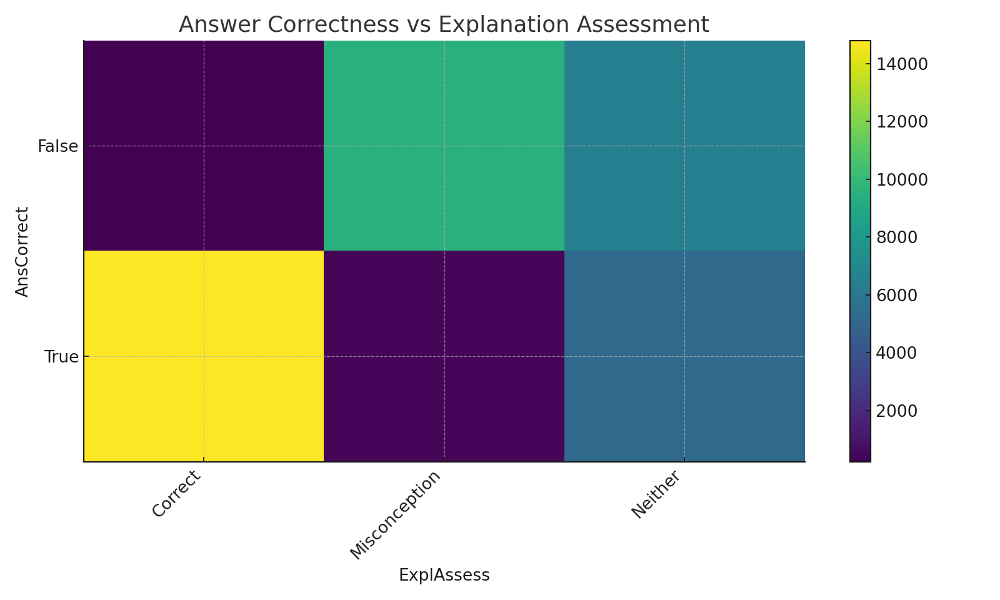
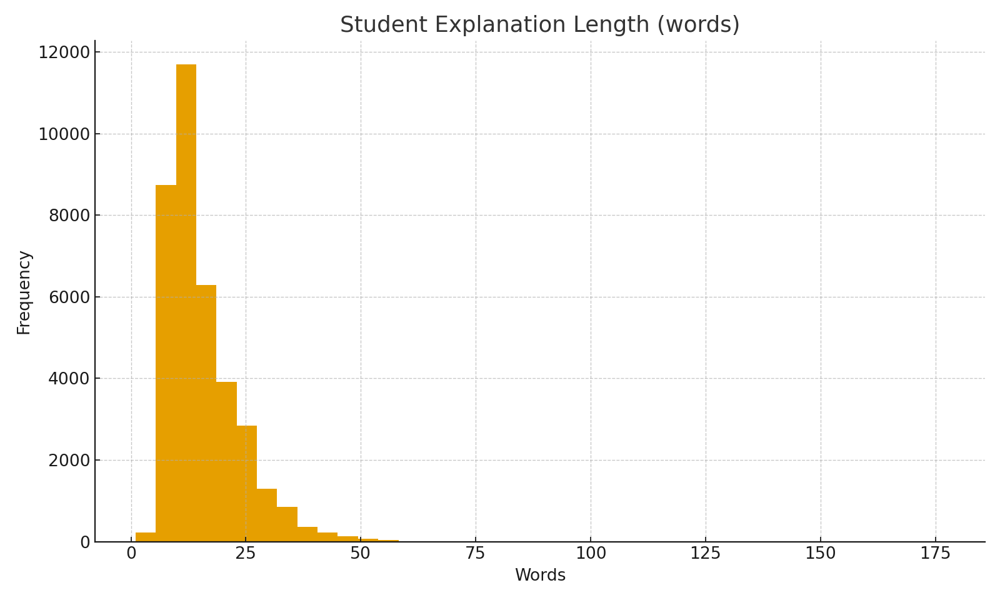
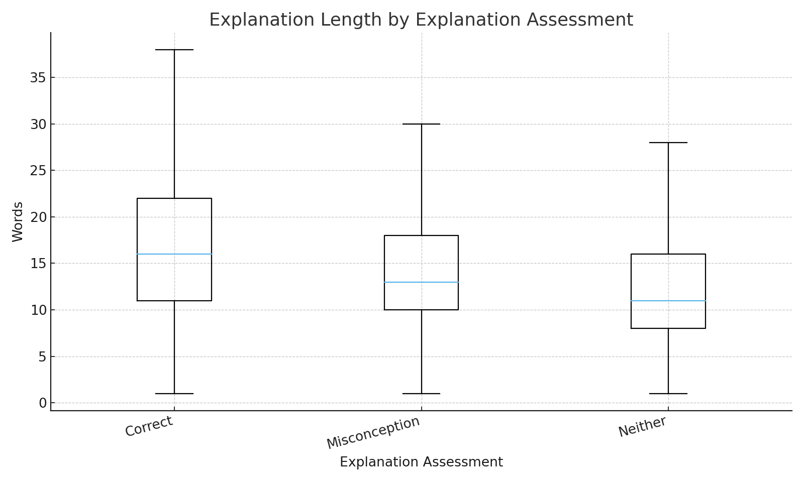
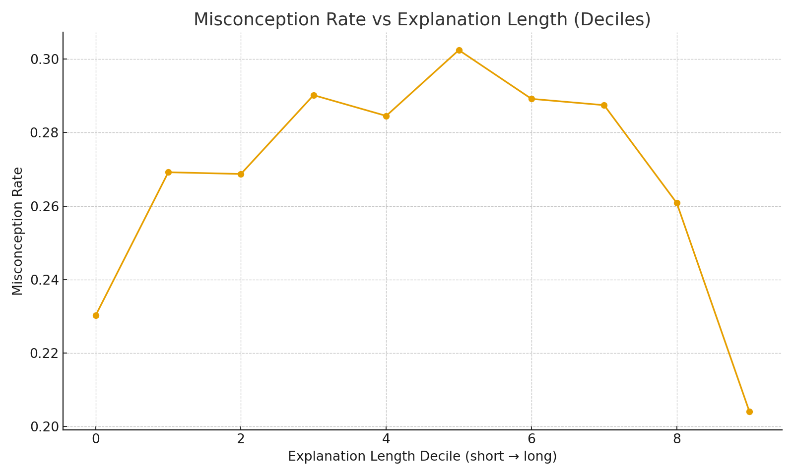
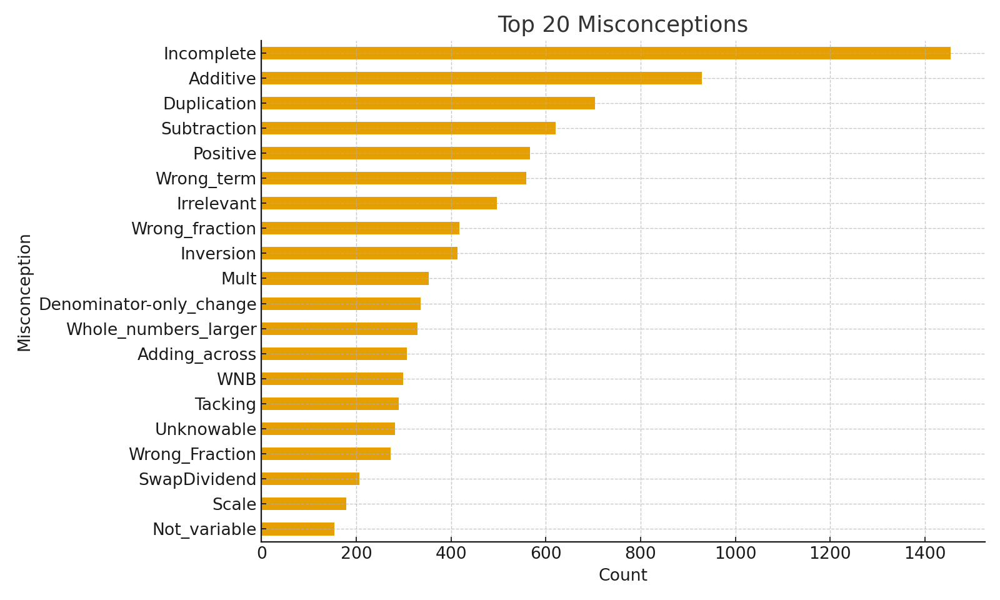

# FlexMask EduRanker: LLM Suffix Ranking for Student Math Misconception Detection

A production-grade, CV-worthy repository showcasing a **1st-place** approach for misconception-aware MCQ scoring.
This project reframes the problem as **suffix classification** using LLMs, **FlexAttention-style masking**, and
**multi-seed ensembling**. Optimized inference is supported via **W8A8 INT8 quantization** interfaces.

> Elevator pitch: *Prefix-shared batching + custom attention masks yield stable MAP@3 with scalable training and blazing-fast INT8 inference.*

## Approach: How This System Detects Misconceptions Accurately

This project tackles the task of **identifying student math misconceptions** from the combination of **question**, **chosen answer**, and **written explanation**.  
Instead of training a generic classifier, I reformulate the problem as a **suffix ranking** task:

- For each student response, I build a **rich prefix** that includes:
  - the question  
  - the multiple-choice options  
  - the correct answer  
  - misconception candidates  
  - the student’s selected answer  
  - the student’s explanation  

- I then treat each possible `Category:Misconception` as a **candidate suffix** and ask an LLM to score **which suffix best completes the dialogue**.

Using a **custom attention mask** (inspired by FlexAttention), I can pack:

> `prefix ++ suffix0 ++ suffix1 ++ …`

into a **single sequence**, so that:

- Every suffix sees the **full shared context**.
- Suffixes **cannot leak information** into each other.
- Training stays **efficient** even with **8–12 candidates per question**.

I extract **last-token embeddings** for each suffix, pass them through a simple:

> `nn.Linear(hidden_size, 1)`

head, and train with **cross-entropy** — which aligns perfectly with the **MAP@3 ranking** objective.

To deal with **noisy labels** (especially `Neither`), I don’t rely on single runs. Instead, I:

- Run **5-fold × multi-seed** experiments.
- Use **multi-seed ensembles** (on the hardest fold) to get **stable validation**.
- Prefer **loss** over raw MAP@3 for **model selection**.
- Scale up to **32B LLMs** using:
  - `offload_adam` for full-parameter training under memory constraints,  
  - **layer-wise inference**, and  
  - **W8A8 INT8 quantization**, so I can **ensemble large models** even on limited GPUs.

The result is a system that doesn’t just **guess the right label**, but **ranks misconception hypotheses** with high accuracy and robustness — even in the presence of **label noise** and **long-tailed misconception labels**.

## Highlights

- **Suffix classification** with prefix-shared formatting for efficient batching
- **Custom FlexMask** attention logic isolating suffixes while preserving causal structure
- **Multi-seed ensembling** (5× folds × seeds; robust & reliable validation)
- **Quant-ready inference** (interfaces for W8A8 INT8; bitsandbytes fallback)
- **Reproducible CV** pipeline with stratified splits by `Category`
- Clean, commented code with type hints, unit tests, CI, and docs

## Quickstart

```bash
# 1) Create environment (example)
python -m venv .venv && source .venv/bin/activate
pip install -r requirements.txt

# 2) Prepare data (expects a CSV with required columns; see docs/methodology.md)
python scripts/prepare_data.py --input data/train.csv --output_dir artifacts/data --folds 5

# 3) Train (single fold/seed example)
python -m suffixranker.train --config configs/train.yaml

# 4) Inference (optionally quantized via bitsandbytes)
python -m suffixranker.infer --config configs/infer.yaml

# 5) Ensemble predictions
python -m suffixranker.ensemble --inputs artifacts/preds/run_*/*.jsonl --output artifacts/preds/ensemble.jsonl
````

## Repository Structure

```
flexmask-suffixranker/
├─ README.md
├─ LICENSE
├─ requirements.txt
├─ pyproject.toml
├─ .gitignore
├─ .github/workflows/ci.yml
├─ configs/
│  ├─ data.yaml
│  ├─ train.yaml
│  └─ infer.yaml
├─ docs/
│  ├─ methodology.md
│  ├─ results.md
│  └─ design.md
├─ scripts/
│  ├─ prepare_data.py
│  └─ run_cv.sh
├─ src/suffixranker/
│  ├─ __init__.py
│  ├─ data.py
│  ├─ prompt.py
│  ├─ mask.py
│  ├─ model.py
│  ├─ utils.py
│  ├─ train.py
│  ├─ infer.py
│  └─ ensemble.py
├─ tests/
│  └─ test_metrics.py
└─ Makefile
```

## Methodology & Results

* Full write-up: **[docs/methodology.md](docs/methodology.md)**
* Results and validation protocol: **[docs/results.md](docs/results.md)**
* System design, masks, batching: **[docs/design.md](docs/design.md)**

## License

MIT — see [LICENSE](LICENSE).

## Dataset & Task

On Eedi, students answer multiple-choice **Diagnostic Questions (DQs)**—one correct answer and three distractors.
After answering, they sometimes provide a **written explanation**. These explanations are the primary signal used to
identify and address potential **misconceptions** in students’ reasoning.

**Objective (3-step):**

1. Determine whether the selected answer is correct (**True/False**).
2. Assess whether the explanation contains a misconception (**Correct/Misconception/Neither**).
3. Identify the **specific misconception** (or `NA`).

**Files**

* `train.csv`/`test.csv`

  * `QuestionId`, `QuestionText`, `MC_Answer`, `StudentExplanation`
  * `Category` (train only): e.g., `True_Misconception`
  * `Misconception` (train only): concrete label if `Category` contains a misconception, else `NA`
* `sample_submission.csv`

  * `Category:Misconception` — top-k predictions space-separated (up to 3)

The re-run test set has ~16,000 rows.

## Data Insights (EDA snapshots)

Quick, decision-shaping visuals (see **docs/eda.md** for more):

* **Class imbalance** across `Category` motivates **multi-seed ensembling** and loss-aware model selection.
* **Answer × Explanation** structure explains why **prefix-shared, suffix-scored** modeling is effective.
* **Length effects** suggest careful **context windowing** and regularization.
* **Long-tailed misconceptions** justify **ensemble diversity** and robust validation.

| Snapshot                                    | Figure                                                               |
| ------------------------------------------- | -------------------------------------------------------------------- |
| Category distribution                       |         |
| Answer correctness × Explanation assessment |                      |
| Explanation length (words)                  |                    |
| Length by assessment                        |  |
| Misconception rate vs length deciles        |                 |
| Top misconceptions                          |               |

## Evaluation (MAP@3)

We use **Mean Average Precision at 3** (MAP@3). For each observation *i* with true label *yᵢ* and ranked predictions
*Rᵢ = [rᵢ₁, rᵢ₂, rᵢ₃]*, the per-item Average Precision is:
[
\mathrm{AP@3}(i) = \begin{cases}
1, & \text{if } y_i = r_{i1} \
\frac{1}{2}, & \text{if } y_i = r_{i2} \
\frac{1}{3}, & \text{if } y_i = r_{i3} \
0, & \text{otherwise}
\end{cases}
]
and **MAP@3** is the mean of AP@3 over all items.

Examples that all score **1.0** when the correct label is A:

* `[A, B, C]`
* `[A, A, A]`
* `[A, B, A]`

## Submission Format

Output up to **3** `"Category:Misconception"` predictions per row, space-delimited:

```text
row_id,Category:Misconception
36696,True_Correct:NA False_Neither:NA False_Misconception:Incomplete
36697,True_Correct:NA False_Neither:NA False_Misconception:Incomplete
36698,True_Correct:NA False_Neither:NA False_Misconception:Incomplete
```

````

